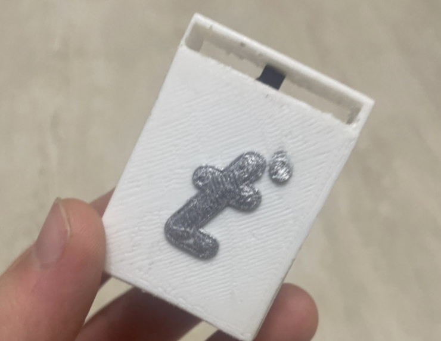
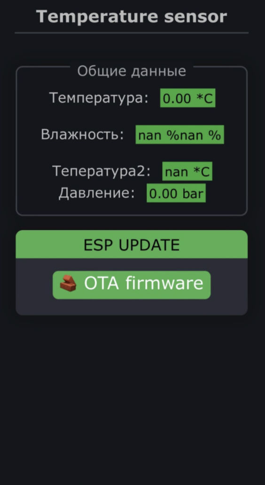

# Temperature Sensor Project

[README](README.md) | [README RU](READMERU.md)

A versatile temperature monitoring system with multiple sensor configurations using ESP8266.

## Project Description

This project implements a temperature monitoring system using ESP8266 microcontroller with two different sensor configurations:

1. DS18B20 Temperature Sensor
2. BMP280 and DHT11 Sensors (Temperature, Humidity, and Pressure)

## Project Structure

```
Temperature-sensor/
├── frimware/
│   └── On bmp280 and dht11/
│       └── build # build folder
|       ├── main.ino  # main code
|   └── On ds18b20/
│       └── build # build folder 
|       ├── main.ino  # main code
|       ├── index.h  # Web page code
|       ├── index.html  # Web page code for ease of layout
├── images/                # images for readme
├── READMERU.md            # Russian readme
├── README.md              # This file
└── LICENCE                # Licence
```


## Hardware Requirements

### Configuration 1 (DS18B20)

- ESP8266 
- DS18B20 Temperature Sensor
- LED indicator
#### DS18B20 Setup
- Sensor Data Pin: GPIO2 (D4)
- LED: Built-in LED

### Configuration 2 (BMP280 + DHT11)

- ESP8266
- BMP280 Sensor (Temperature and Pressure)
- DHT11 Sensor (Temperature and Humidity)
#### BMP280 + DHT11 Setup
- DHT11: GPIO15
- BMP280: I2C (SDA: GPIO0, SCL: GPIO2)

## Software Requirements

### Libraries
- ESP8266WiFi
- ESP8266WebServer
- OneWire
- DallasTemperature
- DHT
- GyverPortal
- Adafruit_BMP280

## Features

### DS18B20 Configuration

- Web interface for temperature monitoring
- Real-time temperature updates
- LED control through web interface

### BMP280 + DHT11 Configuration

- Web interface with dark theme
- Real-time monitoring of:
  - Temperature (from both sensors)
  - Humidity
  - Pressure
- OTA (Over-The-Air) firmware updates


## Setup Instructions

1. Install required libraries through Arduino IDE
2. Choose your preferred sensor configuration
3. Upload the corresponding sketch to your ESP8266
4. Connect to the device's WiFi network
5. Access the web interface through your browser in `192.168.4.1`

## Contributing
Contributions are welcome! Please feel free to submit a Pull Request.

## License
This project is licensed under the GPL-3.0 - see the [LICENSE](LICENSE) file for details.

