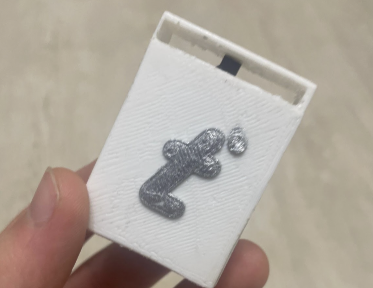
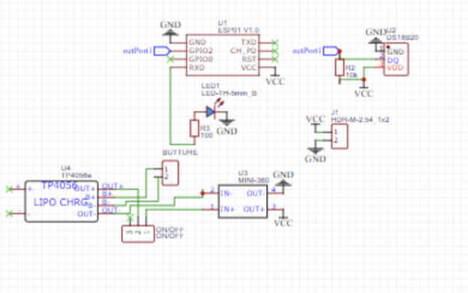
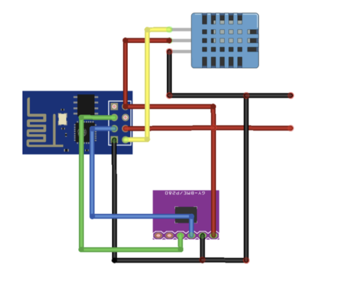
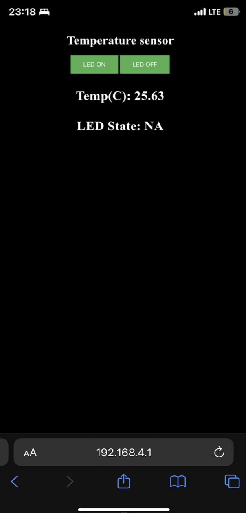
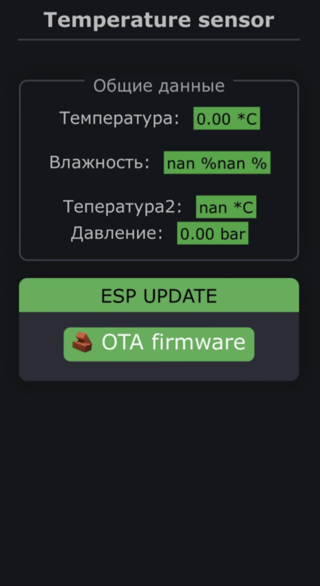

# Temperature Sensor Project

[README](README.md) | [README RU](READMERU.md)

Универсальная система мониторинга температуры с несколькими конфигурациями датчиков на базе ESP8266.

## Описание Проекта

Этот проект реализует систему мониторинга температуры с использованием микроконтроллера ESP8266 с двумя различными конфигурациями датчиков:

1. Датчик температуры DS18B20
2. Датчики BMP280 и DHT11 (температура, влажность и давление)

## Структура Проекта

```
Temperature-sensor/
├── frimware/
│   └── On bmp280 and dht11/
│       └── build # Папка с билдом 
|       ├── main.ino  # Основной код приложения
|   └── On ds18b20/
│       └── build # Папка с билдом 
|       ├── main.ino  # Основной код приложения
|       ├── index.h  # Код веб страницы
|       ├── index.html  # Код веб страницы для удобства верстки
├── images/                # images for readme
├── READMERU.md            # Этот файл
├── README.md              # Основной README
└── LICENCE                # Лицензия
```

## Требования к Оборудованию

### Конфигурация 1 (DS18B20)

- ESP8266
- Датчик температуры DS18B20
- LED индикатор
#### Настройка DS18B20
- Пин данных датчика: GPIO2 (D4)
- LED: Встроенный LED


### Конфигурация 2 (BMP280 + DHT11)

- ESP8266
- Датчик BMP280 (температура и давление)
- Датчик DHT11 (температура и влажность)
#### Настройка BMP280 + DHT11
- DHT11: GPIO15
- BMP280: I2C (SDA: GPIO0, SCL: GPIO2)

## Требования к Программному Обеспечению

### Библиотеки
- ESP8266WiFi
- ESP8266WebServer
- OneWire
- DallasTemperature
- DHT
- GyverPortal
- Adafruit_BMP280

## Возможности

### Конфигурация DS18B20

- Веб-интерфейс для мониторинга температуры
- Обновление температуры в реальном времени
- Управление LED через веб-интерфейс

### Конфигурация BMP280 + DHT11

- Веб-интерфейс с темной темой
- Мониторинг в реальном времени:
  - Температура (с обоих датчиков)
  - Влажность
  - Давление
- OTA обновление прошивки

## Инструкции по Настройке

1. Установите необходимые библиотеки через Arduino IDE
2. Выберите предпочтительную конфигурацию датчиков
3. Загрузите соответствующий скетч на ESP8266
4. Подключитесь к WiFi сети устройства
5. Получите доступ к веб-интерфейсу через браузер на `192.168.4.1`

## Участие в Разработке
Мы приветствуем ваш вклад! Не стесняйтесь отправлять Pull Request.

## Лицензия
Этот проект распространяется под лицензией GPL-3.0 - подробности в файле [LICENSE](LICENSE).